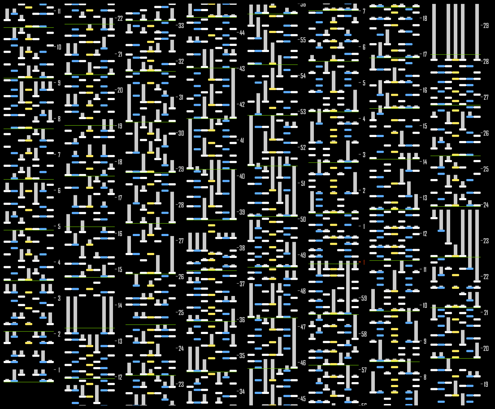

# mania-image

A TypeScript library for rendering osu!mania beatmaps to PNG images using Canvas 2D API.



## Features

- **Canvas-based rendering** — draws directly to Canvas 2D, no DOM overhead
- **Dual environment** — works in browser (`OffscreenCanvas`) and Node.js (`@napi-rs/canvas`)
- **Vertical strip layout** — splits long timelines into side-by-side strips
- **Customizable** — notes, barlines, axis labels, colors, and layout modes are all configurable

## Installation

```bash
pnpm add mania-image
```

## Usage

### Browser

```typescript
import { render, type Beatmap } from 'mania-image'

const beatmap: Beatmap = { keys, notes, timingPoints }
const blob = await render(beatmap, {
  layout: { mode: 'size', size: [800, 600] },
})
// blob →  src or file download
```

### Node.js

```typescript
import { render } from 'mania-image/node'
import { createCanvas } from '@napi-rs/canvas'

const { canvas } = render(beatmap, (w, h) => {
  const c = createCanvas(w, h)
  return { canvas: c, ctx: c.getContext('2d')! }
}, opts)

canvas.toBuffer('image/png') // → Buffer
```

**Note:** This package does not include .osu file parsing. You can use [`osu-mania-io`](https://github.com/zzzzv/osu-mania-io) or [`osu-parsers`](https://github.com/kionell/osu-parsers) to parse beatmaps, then pass the data to `render()`.

## Layout Modes

| Mode | Description |
|------|-------------|
| `num` | Split timeline into a fixed number of strips |
| `time` | Split timeline into strips of fixed duration (ms) |
| `ratio` | Auto-calculate strip count to match a target aspect ratio |
| `size` | Auto-calculate to fit an exact output size (e.g. `[800, 600]`) |

## Options

```typescript
const defaultOptions = {
  note: {
    /** Width of each column in px */
    width: 20,
    /** Height of regular notes in px */
    height: 6,
    /** Corner radius in px */
    rx: 2,
    /** Width of long note body in px */
    bodyWidth: 10,
    color: {
      head: {
        schemes: { a: '#FFFFFF', b: '#5EAEFF', c: '#FFEC5E', d: '#FF3F00' },
        layouts: { /* key count → color scheme mapping */ },
      },
      body: '#CCCCCC',
    },
  },
  barline: {
    /** Stroke width of bar lines in px */
    strokeWidth: 1,
    color: '#85F000',
  },
  axis: {
    /** Width of the axis area in px */
    width: 30,
    fontFamily: 'Segoe UI, system-ui, sans-serif',
    minute: { color: '#FF3F00', strokeWidth: 2, fontSize: 18 },
    second: { color: '#FFFFFF', strokeWidth: 1, fontSize: 18 },
  },
  time: {
    /** Start time in ms ('auto' = first note) */
    start: 'auto' as 'auto' | number,
    /** End time in ms ('auto' = last note) */
    end: 'auto' as 'auto' | number,
    /** Vertical scale: px per ms */
    scale: 0.1,
  },
  layout: {
    /** Margin around strips in px */
    margin: 10,
    background: { color: '#000000' },
    mode: 'time',
    time: 15000,
  },
  renderer: {
    devicePixelRatio: 1,
    antialias: true,
    backgroundAlpha: 1,
  },
}
```

## Exports

| Path | Environment | Entry |
|------|-------------|-------|
| `mania-image` | Browser | `OffscreenCanvas` → `Blob` via `convertToBlob` |
| `mania-image/node` | Node.js | External canvas factory → raw canvas |

## License

MIT
